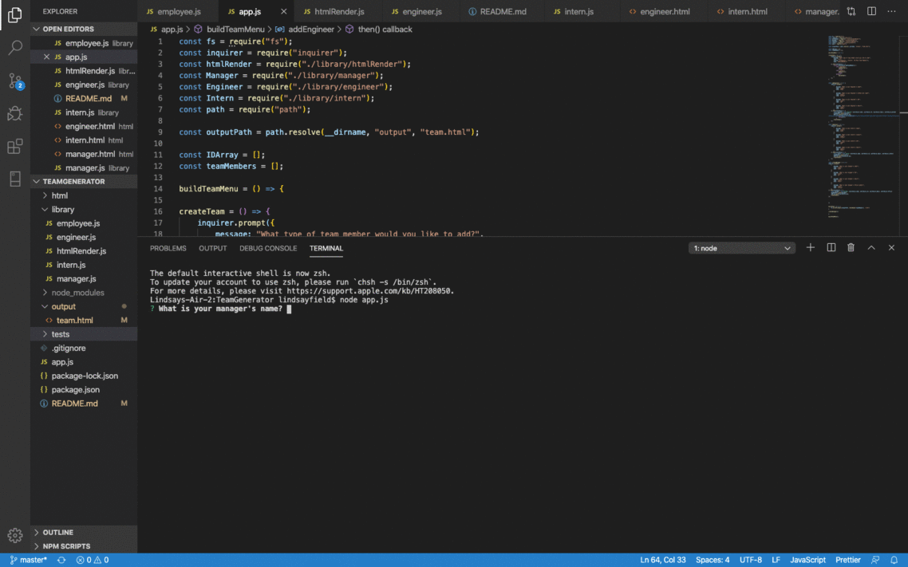

# TeamGenerator
A node based application that generates a team profile on an html page.

## Requirements & Installation
This command line app uses Node.js and requires the installation of inquirer & fs (npm install).

## Usage
This app is designed to be used in the command line and then produce an html page of the team created. To begin, run the installation. Then run 'node app.js' in the command line and follow the prompts to enter information about your team members. 

## Demo 

